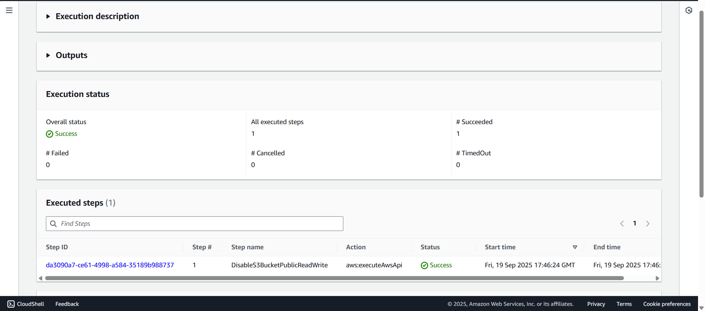
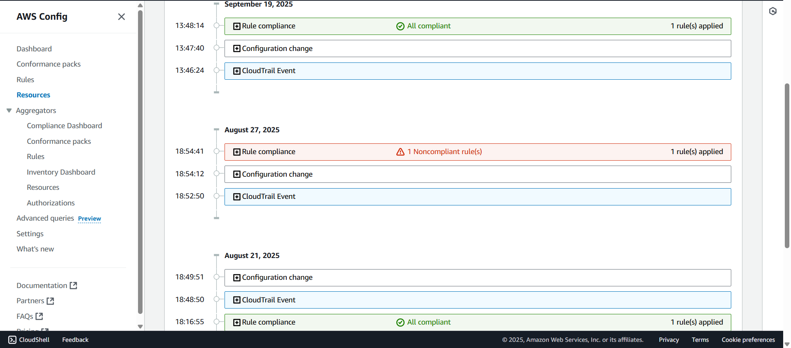
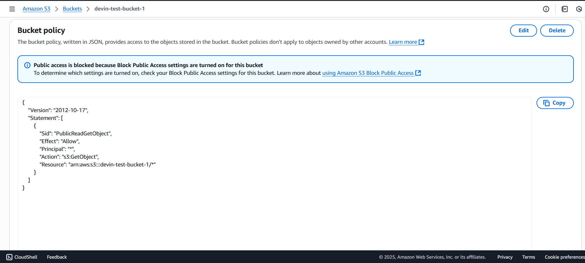

# AWS Config Compliance Automation

## Overview
This project demonstrates how **AWS Config** can automatically detect and remediate compliance violations in Amazon S3 buckets.  
The focus was on preventing one of the most common cloud security risks: **publicly accessible S3 buckets**.

I built this as a learning project while exploring **cloud compliance, GRC, and automation in AWS**.  

---

## What Was Implemented
- Secured AWS account (root MFA, billing guardrails).
- Enabled AWS Config recorder in `us-east-1`.
- Added AWS Managed Rule: `s3-bucket-public-read-prohibited`.
- Made a test bucket public → Config flagged ❌ Noncompliant.
- Remediation runbook: `AWS-DisableS3BucketPublicReadWrite`.
- Manual remediation via Systems Manager → bucket flipped private.
- Config re-evaluated → ✅ Compliant.

---

## Screenshots

### 1. Systems Manager Remediation
Execution of `AWS-DisableS3BucketPublicReadWrite` showing **Success**.  

### 2. AWS Config Timeline
Compliance history for the test bucket showing it flipped to ✅ Compliant after remediation.  

### 3. S3 Bucket (After Remediation)
Permissions tab showing the bucket is no longer publicly accessible.  

---

## Why This Matters
- Public S3 buckets are a **leading cause of data breaches**.  
- This project shows the full **compliance lifecycle**:  
  - **Detect** → AWS Config flags violations  
  - **Remediate** → Systems Manager fixes the issue  
  - **Verify** → Config marks the resource compliant again  

- Skills demonstrated:
  - AWS Config (compliance as code)  
  - Systems Manager Automation (runbooks)  
  - IAM + remediation roles  
  - Cloud security in a compliance context  

---

## Author
Project by **Devin Anderson**  
*(Built as part of my cloud compliance learning journey — linking here for recruiters and peers to explore.)*
